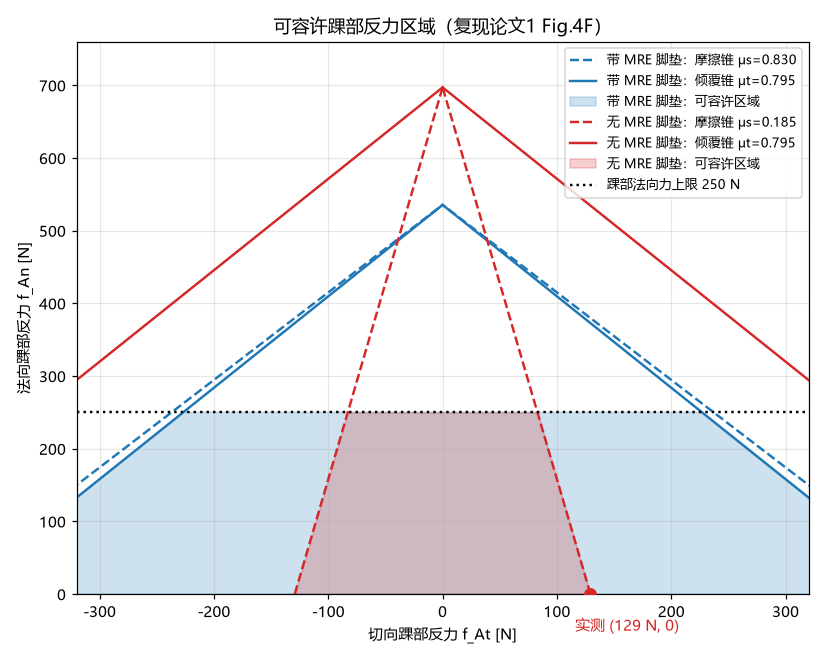
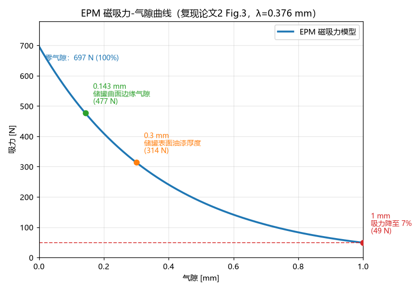

# 阶段报告（阶段 0–2：环境搭建 / 静态分析 / 2D 物理内核）

日期：2026-09-06

---

## 1. 项目背景与目标

复现两篇磁吸附爬壁四足机器人论文：

| 编号 | 论文 | 内容 |
|---|---|---|
| 论文1 | Hong et al., *Agile and versatile climbing on ferromagnetic surfaces with a quadrupedal robot (MARVEL)*, Science Robotics, 2022 (eadd1017) | 硬件设计（EPM 电永磁 + MRE 磁流变弹性体脚垫）+ SRB-MPC 控制框架 |
| 论文2 | Um et al., *Reinforcement Learning-based Robust Wall Climbing Locomotion Controller in Ferromagnetic Environment*, arXiv:2510.20174, 2025 | PPO 强化学习 + 三阶段课程学习 + 随机吸附失效，与论文1 的 MPC 基线对比 |

**核心交付目标**：自研仿真环境（老师要求用 Pygame 构建）→ 复现论文1 MPC 基线 → 复现论文2 PPO 控制器 → 重做论文2 Table II 消融实验与 MPC vs RL 吸附失效对比（Fig.5）。两篇论文均无官方开源代码，全部从零实现。

## 2. 技术路线总览

- **2D 矢状面简化**：躯干 3 自由度（x, z, 俯仰 φ），四条腿投影到同一平面，每条腿 2 关节（髋+膝）共 8 关节 + 4 个磁开关动作。腿序 RR/FR/RL/FL 与论文2 观测定义一致。
- **物理内核 = numpy 向量化自研**（支持数千并行环境，Gym 风格 API），**Pygame 仅负责渲染与键盘交互**——满足"用 pygame 构建环境"的要求，同时保留物理引擎的数值可控性。
- **课程学习与论文2 一致**：重力矢量旋转 g(t) = (−g·sinθ, −g·cosθ)，θ 由 0° 渐变至 90°（平地→垂直墙）；地形保持水平，渲染时反向旋转视角。
- 控制频率 50 Hz（control_dt = 20 ms，与论文1 一致），每控制步 100 个物理子步（dt = 0.2 ms，理由见 §5.3）。

## 3. 阶段0：开发环境搭建 ✅

- 项目 venv：`marvel_repro\.venv`（基于 D:\anaconda 的 Python 3.12）
- 依赖：numpy / matplotlib / scipy / pygame 2.6.1 / torch 2.5.1+cpu（清华镜像不可用，pip 走系统代理；torch 新版在本机报 c10.dll 加载失败，锁定 2.5.1+cpu）
- matplotlib 中文字体：Microsoft YaHei

## 4. 阶段1：静态分析复现 ✅

### 4.1 可容许踝部反力区域（复现论文1 Fig.4F）

基于论文1 Eq.1–10 推导二维矢状面投影下的失效判据：

- **滑移失效**（摩擦锥）：|f_At| ≤ μs·(f_mag − f_An)
- **倾覆失效**（倾覆锥）：|f_At| ≤ μt·(f_mag − f_An)，μt = l/(6h)
- **关节力矩上限**：f_An ≤ 250 N（论文 Fig.4F 水平截断线）

关键参数（论文1 table S1 实测吸持力）：

| 脚垫构型 | 法向吸持力 f_mag | 切向吸持力 | 摩擦系数 μs | 主导失效模式 |
|---|---|---|---|---|
| 带 0.25mm MRE 脚垫 | 535.4 N | 444.6 N | **0.830** | 倾覆主导（μt=0.795 略窄于 μs） |
| 无 MRE 脚垫 | 697.1 N | 129.3 N | **0.185** | 滑移主导（μs 远窄于 μt） |

倾覆系数 μt = l/(6h) = 0.795（踝高 h=13mm，磁脚边长 l=62mm，论文 Fig.3B）。结论与论文一致：**无 MRE 时滑移锥极窄（0.185），动态爬行切向力稍大即滑移；MRE 脚垫把摩擦系数提升 4.5 倍（0.185→0.830），滑移锥扩至与倾覆锥几乎重合，可容许区域大幅扩大——与论文"MRE 提供大剪切+法向保持力、防止动态爬行中滑移"一致**。

### 4.2 EPM 磁吸力-气隙曲线（复现论文2 Fig.3）

论文2 指出 EPM 必须与钢板形成闭合磁路，存在气隙时吸力急剧下降（1mm 气隙 → 约 7%）。采用指数衰减模型：

**F(gap) = F_max · exp(−gap/λ)，λ ≈ 0.3765 mm**

λ 由论文的 7%@1mm 数据点标定：λ = 1/ln(1/0.07)。标注了论文1 中的典型气隙场景：储罐曲面边缘气隙 0.143mm、表面油漆厚度 0.3mm。

## 5. 阶段2：2D 物理内核 ✅

### 5.1 动力学模型

- **躯干单刚体（SRB）**：论文1 Fig.5B 的假设——腿质量相对 8 kg 躯干可忽略，足端环境力直接施加于躯干质心；转动惯量 I = 0.084 kg·m²（330×131mm 箱体近似）。
- **无质量腿 + 虚拟关节惯量**：q̈ = τ/I_v（I_v = 0.05），关节 PD（kp=60, kd=1.2）跟踪目标位型；力矩动作经限幅（τ_max=30 N·m）叠加，为阶段3 的 MPC 前馈（τ_des = Jᵀf_des）与阶段4 的 RL 力矩动作（论文2 a_joint）预留统一接口。
- 半隐式欧拉积分。

### 5.2 接触与吸附模型

- **罚函数法向接触**：弹簧-阻尼（k_n = 1e6 N/m, d_n = 1500 N·s/m），仅在穿透（gap<0）时产生，避免悬空足"幽灵阻尼"。
- **锚点库仑摩擦（stick-slip）**：接触建立时锚点固定于接触点，切向弹簧（k_t = 2e5 N/m）提供静摩擦；|F_t| > μN 时锚点沿力方向滑移实现动摩擦。滑移判定仅基于弹簧力（阻尼项不参与容量判定，防止滑移触发时锚点重置注入能量）。
- **EPM 模型（论文2 Eq.1–4 四步判定链）**：
  1. 接触识别（几何间隙 gap < 0）
  2. 磁开关动作 a_magnet ≥ 0.5
  3. 随机吸附：落地瞬间掷骰 X ~ U(0,1) ≤ Prob_attach（课程调度 1.0 → 0.85，论文2 的随机吸附失效；失败后整个接触周期无吸力，重新落地时重掷）
  4. 几何对齐：气隙力曲线 F = F_max·exp(−max(gap,0)/λ)（穿透时饱和于 F_max）

### 5.3 关键数值问题排查（附：物理步长的确定）

调试中发现垂直墙吸附时俯仰角持续发散（φ 在 0.22s 内达 1.24 rad）。逐项排查过程：

1. **排除摩擦耦合**：令 μ=0 完全关闭摩擦，发散依旧 → 问题在法向/磁吸/俯仰动力学本身；
2. **逐子步能量审计**：弹簧/磁吸/阻尼各通道做功均为负（耗散），但系统总能量凭空增加 **+2.7 J/子步**——离散时间能量泵浦的直接证据；
3. **根因定位**：罚函数接触刚度 1e6 N/m 与磁吸力在近表面气隙处的等效刚度 F_max/λ ≈ 1.85e6 N/m 使俯仰模态频率达 ω ≈ 1.4×10³ rad/s；dt=1ms 时 ω·dt ≈ 1.4，半隐式欧拉在"接触↔气隙"刚度切换处将 O(dt²) 误差整流为持续能量注入，俯仰振荡每半周期放大 ~3 倍；
4. **解决**：物理步长取 **dt = 0.2 ms**（每控制步 100 子步，控制频率仍 50 Hz）。ω·dt ≈ 0.27，垂直墙平衡态精确收敛到磁吸平衡穿透 δ = F_max/k_n ≈ 0.7 mm（体高 z = 0.1493 m），俯仰稳定。

> 注：这是自研物理引擎必须面对的问题——商业引擎（RaiSim 等）靠隐式接触求解器解决；本项目用更细的物理步长在保证数值稳定性的同时保持接触模型可解释。

### 5.4 验证结果（12/12 通过）

`scripts/test_env.py`：

| # | 验证项 | 结果 |
|---|---|---|
| 1 | 平地站立（θ=0，5s）：体高 ≈ 0.15m | ✅ z = 0.1493 m |
| 2 | 平地站立：俯仰角 ≈ 0 | ✅ φ ≈ 0 |
| 3 | 平地站立：速度 ≈ 0 | ✅ v ≈ 0 |
| 4 | 平地站立：无 NaN | ✅ |
| 5 | 垂直墙（θ=90°，5s）：保持吸附未终止 | ✅ |
| 6 | 垂直墙：体高 ≈ 0.15m | ✅ z = 0.1493 m |
| 7 | 垂直墙：无滑移 | ✅ v_x ≈ 0 |
| 8 | 垂直墙：磁吸力 ≈ 697 N/脚 | ✅ F_mag = [697, 697, 697, 697] |
| 9 | 垂直墙：总摩擦力 = mg（静力平衡） | ✅ ΣF_t = 78.5 N（mg = 78.5 N）|
| 10 | 断磁滑落：加速下滑 | ✅ v_x = −9.79 m/s（1s 后）|
| 11 | 断磁滑落：磁吸力归零 | ✅ |
| 12 | 随机吸附统计（Prob_attach=0.85，200 次落地） | ✅ 87.0%（682/784）|

### 5.5 Pygame 渲染与交互

`scripts/sim_demo.py`：实时渲染（0°/45°/90° 重力倾角一键切换、磁脚总开关、复位）。渲染视图随 θ 反向旋转，θ=90° 时地面显示为竖直墙面、重力朝屏幕下方。顺带修复了 pygame 2.6.1 在 Windows 的 SysFont 注册表扫描崩溃（改为直接加载字体文件）。

### 5.6 性能

numpy 向量化：约 **300 μs/环境/控制步**；2048 并行环境 ≈ 10 万 env-steps/s，满足阶段4 PPO 训练规模需求。

## 6. 实现参数与论文对应关系

| 参数 | 数值 | 来源 |
|---|---|---|
| 躯干质量 / 转动惯量 | 8 kg / 0.084 kg·m² | 论文1 |
| 体长 / 标称体高 | 330 mm / 150 mm | 论文1 Fig.2/5B |
| 腿长 l1 = l2 | 200 mm | 论文1 |
| 控制频率 / 物理步长 | 50 Hz / 0.2 ms | 论文1 控制频率 + 本项目数值稳定要求 |
| 摩擦系数 μ | 0.185（无 MRE）/ 0.830（MRE）| 论文1 table S1 |
| EPM 最大吸力 / 衰减系数 | 697.1 N / λ=0.3765 mm | 论文2 Fig.3（1mm→7%）|
| 吸附成功概率课程 | 1.0 → 0.85 | 论文2 三阶段课程 |
| 关节力矩上限 / PD 增益 | 30 N·m / (60, 1.2) | 论文1 电机规格 / 常规整定 |

## 7. 后续计划

| 阶段 | 内容 | 状态 |
|---|---|---|
| 3 | 论文1 MPC 控制器：SRB-MPC 二次规划（摩擦锥+吸附力约束+力矩限制）、三次 Bézier 摆动腿、Raibert 落足点、EPM 5ms 开关时序；验证垂直墙/天花板爬行 | 待开始 |
| 4 | 论文2 PPO 控制器：actor/critic 网络 [256,128,64] + estimator、Table I 奖励函数、三阶段课程（Eq.5–7）、域随机化 | 待开始 |
| 5 | 对比与消融实验：论文2 Table II（Full / w/o Curriculum / w/o Probabilistic / w/o Modeling）+ MPC vs RL 吸附失效对比（Fig.5），5 项指标（速度 RMSE、提前终止率、平均时间、保持率、恢复率）| 待开始 |
| 6 | 复现报告材料汇总 | 待开始 |
